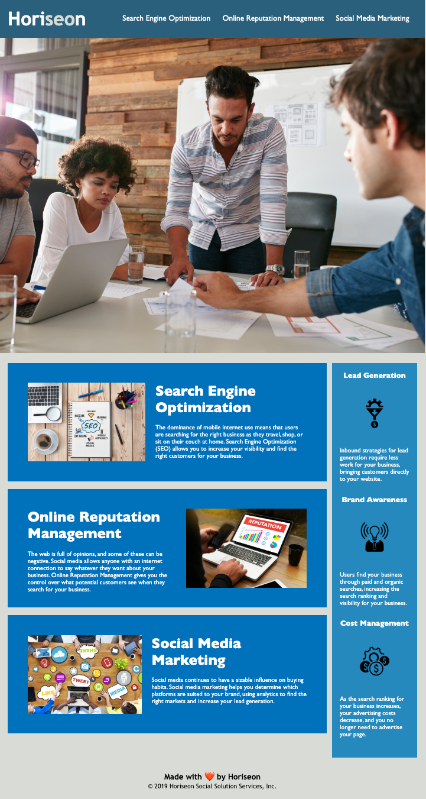

# Horiseon refactoring project (challenge_1)

## Desription

-As a user I want the website to be accesible to people who may have sight impairment, and make the HTML and CSS easy to read and make sense structurally 

-The starter HTML code did not use semantic elements and the CSS had a lot of redundencies and was structurally inconsistent with the HTML

-The refactored code makes the HTML and CSS a lot easier to understand by replacing the existing HTML with semantic HTML and orginizing the CSS to reflect the structure in the HTML and it fixes a few links as well

-I learned the importance of organization and readablity in website design and learned how you can use this to make websites more accesible in the process

## Installation
follow this link to checkout the finished page
[https://taylorgehrts.github.io/challenge_1/](https://taylorgehrts.github.io/challenge_1/)

## Usage

-When visiting the site styling will remain the same as the starter code

-All the links will function and take you to the appropriate part of the page utilizing inline ids

-Images will now have alt descriptions for use with screen readers

-When viewing the HTML it will be far more clear as to which blocks represent each part of the page

-When viewing the CSS it will be clearly commented and will follow the structure of the HTML

## Credits
Starter code courtesy of Xander Rapstine
[https://github.com/coding-boot-camp/urban-octo-telegram](https://github.com/coding-boot-camp/urban-octo-telegram)